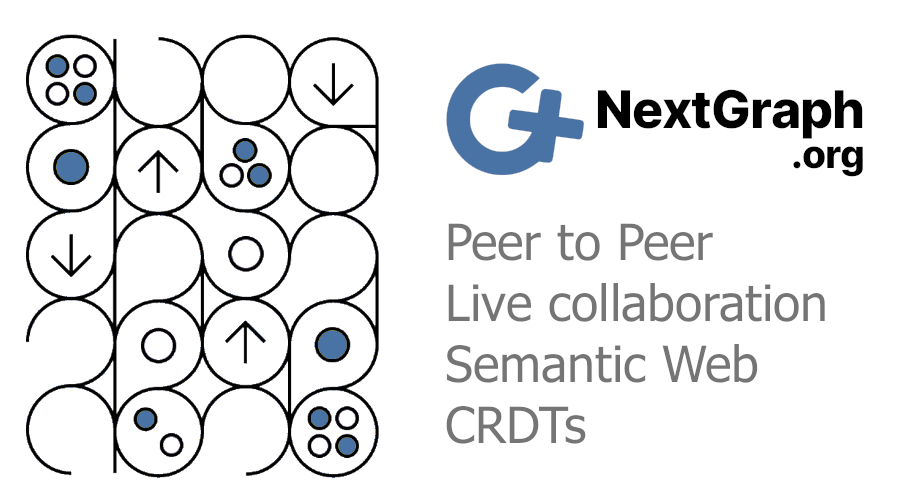

<p align="center">
    
</p>

# ngd

![MSRV][rustc-image]
[![Apache 2.0 Licensed][license-image]][license-link]
[![MIT Licensed][license-image2]][license-link2]

Daemon of NextGraph

This repository is in active development at [https://git.nextgraph.org/NextGraph/nextgraph-rs](https://git.nextgraph.org/NextGraph/nextgraph-rs), a Gitea instance. For bug reports, issues, merge requests, and in order to join the dev team, please visit the link above and create an account (you can do so with a github account). The [github repo](https://github.com/nextgraph-org/nextgraph-rs) is just a read-only mirror that does not accept issues.

## NextGraph

> NextGraph brings about the convergence of P2P and Semantic Web technologies, towards a decentralized, secure and privacy-preserving cloud, based on CRDTs.
>
> This open source ecosystem provides solutions for end-users (a platform) and software developers (a framework), wishing to use or create **decentralized** apps featuring: **live collaboration** on rich-text documents, peer to peer communication with **end-to-end encryption**, offline-first, **local-first**, portable and interoperable data, total ownership of data and software, security and privacy. Centered on repositories containing **semantic data** (RDF), **rich text**, and structured data formats like **JSON**, synced between peers belonging to permissioned groups of users, it offers strong eventual consistency, thanks to the use of **CRDTs**. Documents can be linked together, signed, shared securely, queried using the **SPARQL** language and organized into sites and containers.
>
> More info here [https://nextgraph.org](https://nextgraph.org)

## Support

Documentation can be found here [https://docs.nextgraph.org](https://docs.nextgraph.org)

And our community forum where you can ask questions is here [https://forum.nextgraph.org](https://forum.nextgraph.org)

## Status

NextGraph is not ready yet. You can subscribe to [our newsletter](https://list.nextgraph.org/subscription/form) to get updates, and support us with a [donation](https://nextgraph.org/donate/).

## Building

See [Build release binaries](../../DEV.md#build-release-binaries) in the main README.

## Usage

### The first start of ngd will create an invitation for the admin, so you can create your wallet

```
ngd --save-key -l 1440 --save-config
```

Note that for development, we use port 14400 while in production, port 1440 is used.

In the logs/output, you will see a link that you should open in your web browser. If there are many links, choose the one that starts with `http://localhost:`.

The computer you use to open the link should have direct access to the ngd server on localhost. In most of the cases, it will work, as you are running ngd on localhost. If you are running ngd in a docker container, then you need to give access to the container to the local network of the host by using `docker run --network="host"`. see more here https://docs.docker.com/network/drivers/host/

Follow the steps on the screen to create your wallet :)

for the next start of ngd :

```
ngd
```

### Using ngcli with the account you just created

The current directory will be used to save all the config, keys and storage data.
If you prefer to change the base directory, use the argument `--base [PATH]` when using `ngd` and/or `ngcli`.

`PEER_ID_OF_SERVER` is displayed when you first start `ngd`, with a line starting with `INFO  ngd] PeerId of node:`.

`THE_PRIVATE_KEY_OF_THE_USER_YOU_JUST_CREATED` can be found in the app, after you opened your wallet, click on the logo of NextGraph, and you will see the User Panel. Click on `Accounts` and you will find the User Private Key.

By example, to list all the admin users :

```
ngcli --save-key --save-config -s 127.0.0.1,1440,<PEER_ID_OF_SERVER> -u <THE_PRIVATE_KEY_OF_THE_USER_YOU_JUST_CREATED> admin list-users -a
```

## License

Licensed under either of

- Apache License, Version 2.0 ([LICENSE-APACHE2](../../LICENSE-APACHE2) or http://www.apache.org/licenses/LICENSE-2.0)
- MIT license ([LICENSE-MIT](../../LICENSE-MIT) or http://opensource.org/licenses/MIT)
  at your option.

`SPDX-License-Identifier: Apache-2.0 OR MIT`

### Contributions license

Unless you explicitly state otherwise, any contribution intentionally submitted
for inclusion in the work by you shall be dual licensed as below, without any
additional terms or conditions.

---

NextGraph received funding through the [NGI Assure Fund](https://nlnet.nl/assure) and the [NGI Zero Commons Fund](https://nlnet.nl/commonsfund/), both funds established by [NLnet](https://nlnet.nl/) Foundation with financial support from the European Commission's [Next Generation Internet](https://ngi.eu/) programme, under the aegis of DG Communications Networks, Content and Technology under grant agreements No 957073 and No 101092990, respectively.

[rustc-image]: https://img.shields.io/badge/rustc-1.81+-blue.svg
[license-image]: https://img.shields.io/badge/license-Apache2.0-blue.svg
[license-link]: https://git.nextgraph.org/NextGraph/nextgraph-rs/raw/branch/master/LICENSE-APACHE2
[license-image2]: https://img.shields.io/badge/license-MIT-blue.svg
[license-link2]: https://git.nextgraph.org/NextGraph/nextgraph-rs/src/branch/master/LICENSE-MIT
